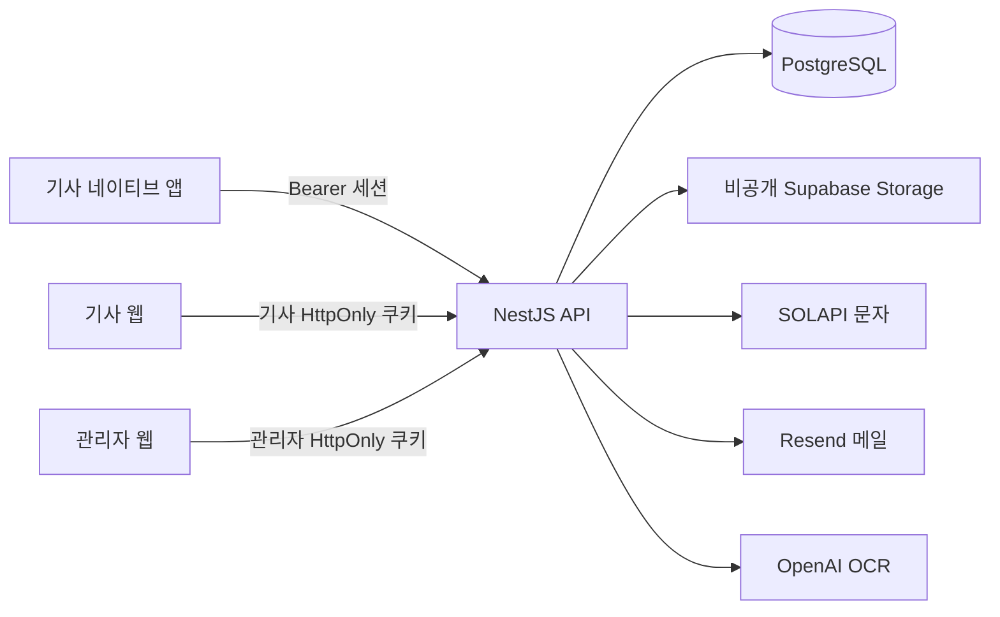

# 하얀100 · H Plus Eco 기술 인수인계

작성 기준: **2026-09-27 / 현재 코드와 배포 기록**

대상: 앱·관리자 웹·API 서버를 이어서 개발하고 운영할 개발자

이 문서는 현재 코드의 실행 방법, 시스템 경계, 확정 정책과 남은 작업을 정리한다. **코드 구현, 격리 환경 검증, 실기기 검증, 운영 배포는 서로 다른 상태**다. 운영 환경과 실제 비밀값은 이번 작성에서 열람하지 않았으며, 배포 완료를 전제로 읽으면 안 된다.

## 1. 먼저 알아야 할 현재 상태

| 구분 | 인수 시 알아야 할 내용 |
|---|---|
| 서비스 | 기사 회원이 영수증·계기판 사진으로 마일리지를 신청하고, 관리자가 심사·물류사별 정산을 처리한다. 주유소 지도도 제공한다. |
| 구성 | 독립 저장소 3개: `hpluseco-app`, `hpluseco-admin`, `hpluseco-server`. 모노레포가 아니므로 설치·실행·커밋도 각각 수행한다. |
| 앱 | React Native 네이티브 UI와 같은 코드의 웹 버전. Expo Router 사용. WebView 기반 앱이 아니다. |
| 관리자 | 데스크톱 웹을 대상으로 한다. 회원·물류사·주유소·마일리지 심사·정산·대시보드 API가 연결돼 있다. |
| 서버 | NestJS + Drizzle + PostgreSQL. 로그인 세션, 비공개 사진 보관, OCR 작업, 승인과 정산을 서버가 관리한다. |
| 최신 변경 | 서버 `1c545c9`은 PostgreSQL과 Supabase Storage S3 연결로 전환돼 main에 배포됐다. 스키마는 빈 운영 `app` 스키마에 적용됐으며 기존 SQLite/R2 데이터 복사는 별도 작업이다. |
| 운영 준비 | 운영 `DATABASE_URL`은 Supabase Session pooler(5432)여야 한다. 이전 배포에서는 Transaction pooler(6543) 설정으로 500이 발생했지만, 2026-09-27 04:22 KST 읽기 전용 확인에서는 API·문서·빈 물류사 목록이 200을 반환했다. 환경 변경 경위는 확인하지 못했으므로 실제 연결 주소와 재배포 이력은 별도로 대조한다. 은행 파일 수용·송금과 최신 네이티브 실기기 흐름도 별도 확인이 필요하다. |

### 작성 완료 전 최종 대조한 소스 기준

| 저장소 | 브랜치 / HEAD | 작업 트리 |
|---|---|---|
| 앱 | `main` / `b2f1ff6` | 문서·정책 변경이 있으며 사용자 소유 변경은 보존한다. |
| 관리자 | `main` / `92ad43d` | 반려 사유 입력 계약을 포함하지만 이 커밋의 원격 반영·배포는 별도 확인한다. |
| 서버 | `main` / `1c545c9` | PostgreSQL·Supabase Storage 전환 커밋이 main에 배포됐다. 04:22 KST 읽기 전용 API 응답은 정상이나 Vercel DB URL의 실제 변경 여부는 확인하지 못했다. |

이 표는 배포 버전이나 원격 저장소 동기화 여부를 뜻하지 않는다. 인수 직전에 각 저장소의 `git status --short`, `git log -1`, 배포된 커밋을 다시 대조한다. 기존 변경은 사용자 소유이므로 초기화하거나 덮어쓰지 않는다.

## 2. 저장소와 시스템 연결

문서 내 상대 링크는 세 저장소가 아래처럼 같은 부모 폴더에 있다는 전제다. 다른 위치에 복제했다면 경로를 맞춘다.

```text
hpluseco/
├── hpluseco-app/       기사 앱(iOS·Android·웹), 공통 QA 문서
├── hpluseco-admin/     관리자 데스크톱 웹
└── hpluseco-server/    인증·업무 API, PostgreSQL·외부 서비스 연동
```



지도 화면은 네이티브에서 `react-native-maps`, 웹에서 네이버 Maps를 사용한다. 위치·목록 데이터는 기사 인증 API로 받는다. Supabase S3 키·문자·메일·OCR 비밀키를 클라이언트에 전달하지 않는다.

### 기술 스택

버전은 설치된 전역 도구의 최신 버전이 아니라 각 저장소 `package.json` 기준이다.

| 저장소 | 주요 버전·도구 | 기준 파일 |
|---|---|---|
| 앱 | Expo `~57.0.13`, React Native `0.86.2`, React `19.2.3`, TypeScript `~6.0.3`, React Hook Form, React Native Paper | [package.json](../package.json), [app.json](../app.json) |
| 관리자 | Vite `^8.2.0`, React `^19.2.8`, TypeScript `~6.0.2`, Oxlint, React Flow | [package.json](../../hpluseco-admin/package.json) |
| 서버 | NestJS 11, TypeScript 5.7 계열, PostgreSQL, Drizzle, postgres.js, Argon2, Jest, Supertest | [package.json](../../hpluseco-server/package.json) |

서버의 명시된 Node 요구사항은 **22.13.0 이상**이다. 이번 조사 환경은 Node `22.17.0`, pnpm `10.33.0`이었다. 앱·관리자는 별도 Node 버전 고정이 없으므로 새 환경에서 각 도구의 호환성 검사를 수행한다. 각 저장소의 lockfile을 유지하고 의존성을 임의로 일괄 갱신하지 않는다.

## 3. 로컬 개발 시작

### 3.1 환경 파일 준비

새 복제본에서만 예시 파일을 복사한다. 기존 환경 파일이 있으면 덮어쓰지 않고 필요한 항목만 확인한다.

| 위치 | 준비할 파일 | 최소 로컬 설정 |
|---|---|---|
| 서버 | `.env.example` → `.env` | `PORT=8080`, `NODE_ENV=development`, `WEB_ORIGINS=http://localhost:4000,http://localhost:5173`, `ADMIN_SESSION_TTL_SECONDS=28800` |
| 앱 | `.env.example` → `.env.local` | `EXPO_PUBLIC_WEB_API_URL=http://localhost:8080`, 네이티브용 `EXPO_PUBLIC_API_URL` |
| 관리자 | 별도 필수 환경 파일 없음 | Vite가 `/api/v1`을 `http://localhost:8080`으로 프록시 |

서버 `.env.example`의 기본 OCR 값은 비활성이다. 처음 환경을 준비할 때 실제 문자·메일·유료 OCR을 실행할 필요는 없다. 다만 해당 공급자 설정이 없으면 그 기능의 실제 성공 흐름을 검증할 수 없다. 로그인할 관리자 계정과 회원가입용 활성 물류사는 별도 준비가 필요하며, 공용 데모 자격 증명은 없다.

### 3.2 실행 명령

각 명령은 표시된 저장소 루트에서 실행한다. 서버 시작은 DB 스키마를 만들거나 바꾸지 않는다. **인계받은 DB에는 먼저 백업·복원 절차를 확인하고, `DATABASE_MIGRATION_URL`로 명시적으로 `pnpm db:migrate`를 실행한다.**

| 실행 위치 | 설치 | 실행 | 기본 접속 |
|---|---|---|---|
| 서버 | `pnpm install --frozen-lockfile` | `pnpm start:dev` | API `http://localhost:8080/api/v1`, Swagger `http://localhost:8080/docs` |
| 앱 | `pnpm install --frozen-lockfile` | `pnpm web` | `http://localhost:4000` |
| 관리자 | `pnpm install --frozen-lockfile` | `pnpm dev` | `http://localhost:5173` |
| 앱 QA 보드 | 앱 의존성 사용 | `pnpm qa` | `http://127.0.0.1:4001/qa/user`, `/qa/admin` |
| 네이티브 앱 | 앱 의존성 사용 | `pnpm start`, 필요 시 `pnpm ios` / `pnpm android` | Metro와 연결된 시뮬레이터·기기 |

의존성 설치와 새 환경의 부팅은 이번 문서 작성 중 다시 수행하지 않았다. 위 명령은 저장소 스크립트와 기존 실행 기록 기준이다. 이미 실행 중인 개발 서버가 있으면 중복 기동하지 않는다.

### 3.3 주소와 쿠키 규칙

- 앱의 API 환경변수에는 `/api/v1`을 붙이지 않는다. 코드가 경로를 추가한다.
- 기사 웹은 `EXPO_PUBLIC_WEB_API_URL`을 우선 사용하고, 없으면 `EXPO_PUBLIC_API_URL`을 사용한다.
- iOS 시뮬레이터는 `http://127.0.0.1:8080`, Android 에뮬레이터는 `http://10.0.2.2:8080`, 실기기는 같은 네트워크의 개발 PC LAN 주소를 설정한다. 기기의 `localhost`는 개발 PC가 아니다.
- 웹 인증에서는 `localhost`와 LAN IP·`127.0.0.1`을 섞지 않는다. 사용자 웹·API의 호스트와 `WEB_ORIGINS`를 일치시킨다.
- `WEB_ORIGINS`는 정확한 Origin의 쉼표 목록이다. 경로와 와일드카드를 넣지 않는다. 변경 후 서버를 재시작한다.
- 운영 쿠키는 Secure를 사용한다. 로컬 HTTP 인증 검증은 비운영 설정에서 수행한다. 쿠키는 포트로 분리되지 않으며 기사·관리자 쿠키는 별개다.

## 4. 환경변수와 외부 서비스

실제 값은 문서·커밋·스크린샷에 남기지 않는다. 인수 시 공급자 계정 권한과 비밀값 전달 경로를 별도로 확인한다. **예시 파일에 존재하는 것과 운영에 설정된 것은 다르다.**

### 앱

기준: [.env.example](../.env.example)

| 변수 | 용도·설정 시점 |
|---|---|
| `EXPO_PUBLIC_API_URL` | 네이티브 API 주소, 웹 기본 주소 |
| `EXPO_PUBLIC_WEB_API_URL` | 웹 전용 API 주소 |
| `EXPO_PUBLIC_NAVER_MAP_CLIENT_ID` | 네이버 Web Dynamic Map의 공개 Client ID(`ncpKeyId`). 정확한 접속 URL 등록 필요 |
| `EXPO_PUBLIC_TMAP_APP_KEY` | 모바일 웹 TMAP Invoke. 비어 있으면 네이버 길찾기로 연결 |
| `EXPO_PUBLIC_SENTRY_DSN`, `EXPO_PUBLIC_SENTRY_ENVIRONMENT` | 배포 앱 오류 수집. DSN 존재 + 개발 모드 아님 조건에서 활성화 |
| `SENTRY_ORG`, `SENTRY_PROJECT`, `SENTRY_AUTH_TOKEN` | 빌드·소스맵 업로드용. 인증 토큰은 공개 런타임 변수로 두지 않음 |

### 서버

기준: [.env.example](../../hpluseco-server/.env.example), [서버 진입점](../../hpluseco-server/src/main.ts), [DB 서비스](../../hpluseco-server/src/database/database.service.ts)

| 변수 | 용도·주의점 |
|---|---|
| `PORT` | 기본 8080 |
| `NODE_ENV`, `VERCEL_ENV` | 운영 여부와 SMS 설정군 선택에 사용. 변수 지원이 특정 플랫폼 배포 완료를 의미하지는 않음 |
| `DATABASE_URL` | 런타임 PostgreSQL 연결. Supabase는 TLS 인증서 검증을 사용하는 Session pooler(5432)를 사용하며 Transaction pooler(6543)는 사용할 수 없음 |
| `DATABASE_MIGRATION_URL` | 명시적 스키마 적용 전용 Direct 또는 Session pooler 연결. `pnpm db:migrate`에 필요하며 런타임 URL을 대체하지 않음 |
| `WEB_ORIGINS` | credential CORS와 웹 변경 요청 Origin 허용 목록 |
| `ADMIN_SESSION_TTL_SECONDS` | 관리자 최대 유지기간. 승인 설정 28800초(8시간), 자동 연장 없음 |
| `SOLAPI_API_KEY`, `SOLAPI_API_SECRET`, `SOLAPI_SENDER_PHONE` | 개발·로컬 문자 설정. 등록된 발신번호 사용 |
| `SOLAPI_API_KEY_LIVE`, `SOLAPI_API_SECRET_LIVE`, `SOLAPI_SENDER_PHONE_LIVE` | 운영 문자 설정. 선택한 설정군이 비어도 다른 설정군으로 대체하지 않음 |
| `PHONE_VERIFICATION_SECRET` | 인증번호 HMAC 전용 비밀값. SOLAPI Secret과 별도 |
| `RESEND_API_KEY`, `RESEND_FROM_EMAIL`, `RESEND_FROM_NAME` | 재설정 메일 공급자·발신 설정 |
| `PASSWORD_RESET_URL` | 재설정 화면의 전체 URL. 서버가 token 쿼리를 추가. 실제 도메인·앱 링크 연결은 별도 검증 |
| `SUPABASE_S3_ENDPOINT`, `SUPABASE_S3_REGION`, `SUPABASE_STORAGE_BUCKET`, `SUPABASE_S3_ACCESS_KEY_ID`, `SUPABASE_S3_SECRET_ACCESS_KEY` | Supabase Storage > S3의 비공개 버킷 연결. 서버가 버킷을 만들거나 공개로 바꾸지 않으며 누락·오류 시 사진 작업은 503 |
| `OPENAI_API_KEY` | 현재 작업 트리의 OCR 공급자 키 |
| `MILEAGE_OCR_ENABLED`, `MILEAGE_OCR_LUNA_DAILY_LIMIT` | OCR 실행 스위치와 양의 일일 요청 예산. 명시적 활성화·키·예산이 필요 |
| `MILEAGE_OCR_AUTO_APPROVE_ENABLED` | 판독과 별도의 자동 승인 스위치. 정확히 `true`일 때만 활성화. 기본 비활성 |

현재 Luna 전환 코드의 일일 예산은 UTC 날짜 기준이며 좌우 반전 보정 호출도 같은 예산을 소비한다. 과거 평가의 공급자별 11회 상한과 남은 사용량 기록은 별도로 인계하고, 새 유료 호출 전 승인 범위를 확인한다.

## 5. 코드 읽는 순서

### 5.1 기사 앱

| 경계 | 파일·폴더 | 책임 |
|---|---|---|
| 시작과 화면 보호 | [app/_layout.tsx](../app/_layout.tsx), [app/index.tsx](../app/index.tsx) | 폰트·스플래시·Provider·Stack, 복원 결과에 따라 `/mileage` 또는 `/login` |
| 인증 상태 | [components/AuthProvider.tsx](../components/AuthProvider.tsx) | 세션 복원, 로그인·로그아웃·탈퇴, 인증 요청 경계 |
| 플랫폼 인증 | [utils/authSession.ts](../utils/authSession.ts), [utils/authSession.web.ts](../utils/authSession.web.ts) | 네이티브 SecureStore / 웹 HttpOnly 쿠키 분리 |
| API | [utils/authApi.ts](../utils/authApi.ts), [utils/mileageApi.ts](../utils/mileageApi.ts), [utils/stationsApi.ts](../utils/stationsApi.ts) | 요청·응답 검증, 오류 변환, 사진 multipart·보호 이미지 처리 |
| 공통 화면 | [components/AppBar.tsx](../components/AppBar.tsx), [components/AppScreen.tsx](../components/AppScreen.tsx) | Safe Area, 키보드, 스크롤, 공용 앱바·하단 영역 |
| 폼·알림 | `components/auth/`, `components/NoticeProvider.tsx`, `components/NoticeModal.tsx`, `utils/alerts.ts` | React Hook Form 입력·SMS UI, 공용 안내창 |
| 마일리지 | [app/mileage/](../app/mileage/), [components/mileage/](../components/mileage/), [utils/mileagePhotos.ts](../utils/mileagePhotos.ts) | 목록·잔액·신청·반려 재등록·사진 준비와 정리 |
| 지도 | [app/map.tsx](../app/map.tsx), [components/map/](../components/map/), [data/mapStations.ts](../data/mapStations.ts) | 실제 주유소 조회, 플랫폼 지도, 클러스터·상세 패널 |
| 공통 규칙 | `utils/validation.ts`, `utils/inputFormat.ts`, `constants/theme.ts`, `constants/assets.ts`, `constants/legalDocuments.ts` | 검증·입력 표시·디자인 토큰·원본 에셋·문서 본문 |

화면별 폼 상태와 서버 요청 조정은 라우트 가까이에 둔다. 공용 UI에 세션·도메인 로직을 넣지 않는다. 웹 폭은 루트의 `webAppFrame` 최대 640px 규칙을 공유한다.

### 5.2 관리자 웹

| 경계 | 파일·폴더 | 책임 |
|---|---|---|
| 진입·라우팅 | [src/App.tsx](../../hpluseco-admin/src/App.tsx) | 자체 History API 라우팅, 경로 이동 시 관리자 세션 재확인 |
| 인증·공통 요청 | [src/adminAuth.ts](../../hpluseco-admin/src/adminAuth.ts) | 상대 `/api/v1/admin` 요청, 쿠키 포함, 15초 timeout, 세션 오류 |
| 페이지 | [src/pages/](../../hpluseco-admin/src/pages/) | 대시보드, 기사, 물류사, 주유소, 영수 심사, 정산, ERD |
| API 모듈 | `src/dashboard.ts`, `drivers.ts`, `logisticsCompanies.ts`, `stations.ts`, `receipts.ts`, `settlements.ts` | 각 화면의 서버 계약과 응답 검증 |
| 연결 설정 | [vite.config.ts](../../hpluseco-admin/vite.config.ts), [vercel.json](../../hpluseco-admin/vercel.json) | 로컬 API 프록시와 배포 rewrite |

`/settlements` 계열은 물류사 관리와 정산 업무가 같은 경로군 안에 있으므로 이름만 보고 역할을 추정하지 말고 `App.tsx`의 페이지 매핑을 확인한다. `/erd`는 정적 데이터로 그린 구조도이며 실제 DB를 조회해 만든 결과가 아니다.

### 5.3 서버

| 경계 | 위치 | 책임 |
|---|---|---|
| 부팅 | [src/main.ts](../../hpluseco-server/src/main.ts), [src/app.setup.ts](../../hpluseco-server/src/app.setup.ts) | `.env`, `/api/v1`, CORS, 입력 검증, 오류 처리, Swagger |
| DB | [src/database/](../../hpluseco-server/src/database/) | PostgreSQL 연결, Drizzle 매핑, 명시적 SQL 마이그레이션 |
| 기사 인증 | [src/auth/](../../hpluseco-server/src/auth/) | 계정·세션·목적별 SMS·복구·비밀번호 변경 |
| 관리자 인증 | [src/admin-auth/](../../hpluseco-server/src/admin-auth/) | 별도 관리자 세션·역할 검사 |
| 마일리지·사진·OCR | [src/mileage/](../../hpluseco-server/src/mileage/) | 신청·사진 저장·재등록·판독 작업·승인 조건·잔액 |
| 나머지 업무 | [src/](../../hpluseco-server/src/) 내 회사·기사·주유소·심사·정산 모듈 | 컨트롤러와 repository를 함께 읽어 권한·트랜잭션 확인 |

HTTP 상세 계약은 실행 중인 서버의 `/docs`와 각 controller·DTO가 기준이다. 인수 문서에 모든 필드를 복제하지 않는다.

## 6. 주요 처리 흐름과 변경하면 안 되는 정책

### 6.1 로그인·회원정보·복구

1. 네이티브는 `/auth/login`이 발급한 세션 토큰과 서버 주소만 SecureStore에 보관한다. 웹은 `/auth/web/login`의 HttpOnly 쿠키를 사용한다.
2. `/auth/me` 성공으로 인증 상태를 확정한다. 앱 시작 시 복원에 성공하면 `/mileage`로 이동한다.
3. `401 INVALID_SESSION`은 세션 만료로 처리한다. 네트워크·서버 오류를 로그아웃이나 빈 데이터로 처리하지 않는다. 다른 서버 주소로 저장된 토큰을 보내지 않는다.
4. 기사 세션은 최대 30일 또는 마지막 정상 인증 요청부터 미사용 7일 중 먼저 도달하면 만료한다. 관리자 세션은 최대 8시간이며 자동 연장하지 않는다.
5. 일반 로그아웃은 현재 세션만, 비밀번호 변경·재설정은 모든 기존 세션을 폐기한다. 비활성 물류사의 기사 세션도 차단한다.

가입·이메일 찾기·비밀번호 찾기는 목적에 맞는 SMS 인증을 요구한다. 유효한 번호 입력만으로 인증 완료로 판단하지 않는다. 서버가 발급한 일회용 `verificationProof`가 최종 요청에 필요하다. 인증번호는 6자리·3분 유효이며 재발송하면 이전 인증은 무효다. 번호·인증번호·복구용 이메일 변경 시 기존 증명을 폐기한다. 임의의 발송 대기시간·시도 제한·로그인 잠금을 추가하지 않는다.

비밀번호는 영문·숫자·특수문자를 포함한 8자 이상이다. 마이페이지의 일반 이름·마케팅 동의 수정은 SMS 면제이고 연락처 변경은 본인 세션에 묶인 `change_phone` 인증이 필요하다. 정보 변경이 없어도 유효한 인증을 마친 경우 기존 이름을 실제 수정 API에 저장할 수 있다.

재설정 링크는 30분·일회용이며 새 메일 접수 성공 시 이전 링크를 무효화한다. `/auth/reset-password/validate`의 비소비 검증에 성공한 뒤 폼을 표시한다. 메일 요청 `202`는 발송 접수이고 배달 완료가 아니다.

관리자 탈퇴와 본인 탈퇴는 회원 식별자·이름·이메일·연락처·소속·영수·정산 이력을 보존하고 비밀번호·세션·복구 링크·관련 인증을 폐기한다. 재가입은 새 회원 ID이며 기존 마일리지를 이전하지 않는다. 보관 기간은 아직 확정되지 않았다.

### 6.2 사진 신청 → 판독 → 심사 → 잔액

```text
사진 선택·검증 → multipart 신청 + idempotencyKey → pending 저장
  → 설정된 OCR 작업 수행
  → 자동 승인 조건 충족 또는 관리자 수동 승인 → approved
  → 조건 불충족·판독 불확실: pending 유지 / 관리자 판단으로 rejected
  → rejected는 같은 신청 ID로 재등록 → pending
```

- 앱 UI의 기본 선택은 `single`: 영수증과 계기판이 함께 찍힌 사진 1장이다. `separate`는 각 사진 2장이다. 서버는 호환성을 위해 `photoMode` 생략 시 `separate`를 적용하므로 한 장 제출에는 `photoMode=single`을 명시해야 한다. 앱 변경과 서버 v11이 함께 필요하다.
- 신규 신청은 UUID v4 `idempotencyKey`를 보낸다. 같은 요청을 재전송할 때 키·사진을 유지한다. 응답을 못 받았다는 이유로 새 키를 만들어 중복 신청하지 않는다.
- 반려 재등록은 `/mileage/applications/:id/resubmit`에 별도 요청 키와 현재 `submissionVersion`을 보낸다. 신청 ID·최초 신청일을 유지하고 과거 반려 결정은 이력에 보관한다.
- 같은 2장 모드에서는 교체한 사진만 보낸다. 2장→1장은 새 합본 사진, 1장→2장은 새 사진 두 장이 필요하다. 기존 사진을 다른 역할로 자동 전용하지 않는다.
- 허용 사진은 JPEG·PNG·HEIC·HEIF·정적 WebP, 파일당 50 MiB 이하다. 서버는 실제 내용·디코딩·픽셀 수를 검사한다. 클라이언트 검증만 신뢰하지 않는다.
- 클라이언트는 10 MiB 초과 또는 긴 변 4096px 초과 시 변환한다. 서버는 방향 보정·긴 변 4096px 이하·sRGB JPEG 품질 90으로 정규화하고 EXIF/GPS를 제거한다. 원본과 정규화본 모두 비공개 저장한다.
- 사진은 권한 검사하는 API로 읽으며 공개 Storage URL을 사용하지 않는다. 네이티브 상세 미리보기는 메모리 URI를 사용한다.
- 수동 승인 입력은 `{ reviewVersion, finalAmount, liters }`다. 확정 금액은 0 이상의 안전 정수, 주유량은 정수 5자리·소수점 3자리 이내 십진 문자열이다. 서버가 금액·마일리지·결정 시각을 함께 저장한다.
- **1리터 = 20마일리지, 1마일리지 = 1원**이다. 서버의 정확한 십진 계산으로 반올림하며 금액÷단가로 리터를 추정하지 않는다.
- 최신 반려 요청은 `{ reviewVersion, rejectionReason }`를 받는다. 사유는 앞뒤 공백 제거 후 1~150자로 필수이며, 관리자 팝업의 자동 높이 textarea와 사유 칩 4개로 입력한다. 같은 버전·같은 사유만 재전송할 수 있고 다른 사유는 409로 기존 결정을 보존한다. 기존 DB 필드와 사용자 상세의 사진 위 사유 표시를 재사용한다.
- 누적 잔액은 **승인·미정산 전체 신청의 서버 합계**다. 현재 페이지나 날짜 필터 결과를 합산해 대체하지 않는다. 조회 실패의 `-`와 정상 잔액 0을 구분한다.

### 6.3 OCR의 현재 경계

현재 코드는 `gpt-6-luna`에 사진 1~2장을 한 요청으로 보낸다. 좌우 반전이 명시적으로 감지될 때만 해당 이미지를 메모리에서 보정하고 최대 1회 추가 요청한다. 불확실한 통신 실패를 자동 재시도하지 않는다. 기존 CLOVA 호출은 최신 서버 변경에서 제거됐으며 과거 DB 열·증거는 보존한다.

2026-09-26 정정된 기획에 따라 읽힌 양쪽 금액 일치·유효한 계기판 리터·중복 없음이 자동 승인 조건이다. 전표 종류·재발행 여부·부가 안내·거래 시각 누락은 승인을 차단하지 않는다. 필수 숫자 판독 실패·불일치·중복 의심은 대기 처리한다. 모든 회원의 금액 두 값·거래 일시 전체 일치와 기존 사진 해시 중복을 검사하고, 별도로 같은 기사의 직전 현재 OCR 결과와 양쪽 금액이 같으면 대기 처리한다. 직전 결과는 완료 시각 순이며 실패 결과를 건너뛰어 더 오래된 금액을 비교하지 않는다.

시간대 없는 국내 영수증은 한국 시간(+09:00)으로 정규화한다. 초 누락·잘못된 날짜/시간은 영수일시를 null로 두며 촬영·업로드 시간으로 보충하지 않는다. 이때도 필수 숫자가 읽히면 승인을 막지 않는다. 자동 승인은 환경 설정이 활성화돼야 하고, 과거 완료 작업을 소급 승인하지 않는다. 실제 유료 평가와 운영 데이터 재처리는 별도다.

### 6.4 정산·대시보드

- 정산 대상은 KST 월말까지 승인된 미정산 신청이다. 첫 대량이체 다운로드 때 대상 신청·소속·마일리지·은행·계좌·예금주를 고정한다. 편입 후 심사로 금액을 변경하지 않는다.
- 다운로드 XLS는 9열, 결과 업로드 XLS는 7열의 승인 양식을 사용한다. **다운로드만으로 지급 완료가 되지 않는다.**
- 결과 파일에는 성공/실패 열이 없어 운영자가 실제 지급 완료한 행만 업로드한다. CMS 정산 식별자를 보존하며, 없을 때는 전체 이력에서 은행·계좌·금액이 유일하게 일치해야 한다.
- 오류 행이 있으면 파일 전체를 반영하지 않는다. 정상 일부 행만 올리면 해당 건만 완료한다. 완료 행 재업로드는 잔액·완료 시각·증빙을 다시 변경하지 않는다.
- 실제 송금 API와 완료 취소는 없다. 실제 지급일은 미정이며 앱의 기존 지급일 표시를 확정 정책으로 해석하지 않는다.
- 사용자 목록과 잔액에서는 정산 완료분을 제외한다. 대시보드의 승인일별 적립 차트는 정산된 과거 적립도 보존한다.

### 6.5 주유소·지도

주소는 하나만 관리하며 과거 `area`·`siteType` 모델은 제거됐다. 주유소 삭제는 종속 기기도 함께 실제 삭제한다. 주유소·기기 변경은 같은 트랜잭션으로 처리한다. 좌표는 숫자·범위를 검사하고 없으면 지도에서 제외한다. 입력만으로 검수 완료 정보를 만들지 않는다.

운영 상태 변경 UI/API는 개발 범위에서 제외됐고 복수 기기 편집 UI는 사용자 확인이 필요하다. 지도 조회 실패와 정상 0건은 구분한다. 네이버·TMAP 실기기 실행은 데이터 API 연동과 별도로 검증한다.

## 7. 기능별 구현·검증 상태

아래 검증은 **기존 개발 기록의 결과**이며 이 문서를 작성하면서 전체 기능을 다시 실행한 결과가 아니다.

| 기능 | 코드·연동 상태 | 확인 근거와 남은 범위 |
|---|---|---|
| 가입·로그인·복원·복구 | 기사 웹·네이티브 API 연결 | 자동 계약 검사와 로컬 웹 기록 있음. 최신 전체 실기기 흐름은 미검증 |
| 마이페이지·탈퇴 | 본인 조회·저장·연락처·로그아웃·탈퇴 연결 | 격리 DB·웹 검증 기록. 실제 사용자 데이터 검증과 구분 |
| 문자·재설정 메일 | SOLAPI·Resend 연결 | 9/14 승인된 실제 시험에서 SMS 공급자 완료·Resend delivered·토큰 검증 기록. 현재 운영 설정·단말 수신 보증은 아님 |
| 물류사·기사·주유소 | 관리자 조회·변경·비활성화/삭제 연결 | 격리 검사 기록. 복수 기기 편집·운영 상태 변경 범위는 별도 |
| 관리자 기사 목록의 금액·마일리지 | 현재 두 열을 `-`로 표시 | 기사 목록 집계는 미연동. 사용자 본인의 누적 잔액 API와 구분 |
| 기사 지도 | 실제 경계 조회·선택 상세·길안내 연결 | 네이버 타일 표시 과거 확인. 최신 클러스터·권한·TMAP 실기기 조합은 재확인 필요 |
| 신청·목록·보호 사진·재등록·잔액 | 기사 API 연결 | [2026-09-27 통합 QA](qa-results-2026-09-27.md)에서 격리 PostgreSQL·실제 로컬 Supabase Storage 흐름을 확인했다. 운영 hosted Storage·실기기와 구분한다. |
| 수동 승인·반려 | 관리자 UI·API 연결, 서버/관리자 커밋에 포함 | 9/26 임시 API·메모리 DB·실브라우저 승인·반려와 숫자 입력 검증 기록 |
| 사진 1장/2장·Luna | 앱·서버 커밋에 포함, DB v11 필요 | 9/26 기록: 앱 관련 28개, 서버 단위 159개·통합 76개 및 격리 웹 검증. 해당 기록에서 유료 OCR·실기기·사용자 DB 적용은 미실행이며 이후 실제 호출 여부는 이번 작성에서 확인하지 않음 |
| 자동 승인 | 트랜잭션 로직·스위치 존재 | 격리 검사와 실제 판독 정확도는 별개. 거래 시각 정책·평가·활성화 승인 남음 |
| 정산·대시보드 | XLS·집계 API와 관리자 화면 연결 | 격리 자동 검사 기록. 은행 파일 수용·실제 송금·운영 적용 미확인 |
| 네이티브 사진 확대 | 기존 앱바를 사용하는 앱 내 확대 구현 | 자동 검사 기록. 최신 iOS·Android 터치·접근성 실기기 미검증 |
| 법적 문서 | `/term`, `/privacy`, `/collection`, `/marketing` 연결 | 본문은 검토용 초안. 공개 전 담당자·보관기간 등 확정 필요 |
| 아이콘·OG·스플래시 | 에셋·Expo 설정·초기 HTML 반영 | 9/26 로컬 export·웹 확인 기록. 설치 앱·런처 마스크·실제 공유 미리보기는 미검증 |
| Sentry·EAS | 초기화·플러그인·업데이트 URL 존재 | 운영 이벤트·소스맵 수신·빌드 배포 완료 근거는 없음 |

## 8. DB와 데이터 운영

### 스키마의 기준

`drizzle/`의 SQL 마이그레이션이 실제 DDL이고, `src/database/schema.ts`는 Drizzle 매핑이다. `DatabaseService`는 런타임 `DATABASE_URL`로 연결만 하며 부팅 중 스키마를 변경하지 않는다. `DATABASE_MIGRATION_URL`을 설정한 뒤 `pnpm db:migrate`로 명시적으로 적용한다. 초기 마이그레이션은 빈 `app` 스키마를 대상으로 하며 SQLite 파일 데이터를 자동으로 가져오지 않는다.

| 데이터 영역 | 주요 보존·변경 규칙 |
|---|---|
| 회원·물류사·세션·SMS·재설정 토큰 | 기사/관리자 인증 분리, 탈퇴 시 이력 보존과 인증 폐기 |
| 주유소·기기 | 부모·자식 변경/삭제의 원자성 |
| 마일리지 신청·사진·재등록 이력 | 신청 키·사진 버전·역사적 심사 결과 보존 |
| 업로드 시도·OCR 작업 | 외부 저장 중단·판독 상태 추적. 재시작만으로 모든 실패가 자동 복구되는 것은 아님 |
| 정산과 편입 항목 | 다운로드 스냅샷, 결과 증빙, 중복 완료 방지 |

현재 PostgreSQL 초기 마이그레이션은 기존 업무 스키마·제약·인덱스와 `app` 스키마 권한을 포함한다. 운영 빈 `app` 스키마에 적용됐다는 기록은 기존 SQLite 파일·R2 객체가 이전됐다는 뜻이 아니다.

### 인수 시 필요한 DB 확인

1. 런타임 `DATABASE_URL`이 TLS 인증서 검증을 사용하는 Supabase Session pooler(5432)인지 확인한다. 포트 6543은 서버가 의도적으로 거부한다.
2. 마이그레이션 전에 복구 가능한 PostgreSQL 백업과 복원 절차를 확인한다. 런타임 URL과 별도의 `DATABASE_MIGRATION_URL`을 사용한다.
3. 복제한 격리 PostgreSQL DB에서 `pnpm db:migrate`와 이력 보존을 먼저 확인한다. 사용자 DB를 테스트 명령에 직접 연결하지 않는다.
4. 기존 SQLite 데이터와 R2 객체를 이전할 때 DB 레코드·사진 참조·원본·정규화 객체를 함께 대조한다. 실패 정리는 미커밋 업로드 시도에 속한 객체만 대상으로 하고, 이미 신청에 연결된 객체를 삭제하지 않는다.

현재 PostgreSQL 연결은 서버 인스턴스 간 데이터를 공유한다. 다만 Vercel의 4.5 MB 요청 제한과 장기 실행 OCR worker 문제는 DB·저장소 전환만으로 해결되지 않으며 API 호스팅 이전 때 검증한다. 사진 자동 삭제 작업과 확정 보관 기간은 없으며 백업 스케줄·복구 훈련·보존 정책은 운영 담당자에게 확인해야 한다.

## 9. 개발 검증 방법

각 명령은 해당 저장소 루트에서 실행한다. 아래는 재현용 명령 목록이며 이번 문서 작성의 실행 결과와 구분한다.

| 저장소 | 기본 검증 | 보완 검증 |
|---|---|---|
| 앱 | `pnpm typecheck`, `pnpm test:auth` | 전체 자동 검사 `node --experimental-strip-types --test tests/*.test.mjs` |
| 관리자 | `pnpm build`, `pnpm lint` | `node --test tests/*.test.mjs` — 별도 package test 스크립트는 없음 |
| 서버 | `pnpm exec tsc --noEmit`, `pnpm exec jest --runInBand --watchman=false` | `TEST_DATABASE_URL`을 둔 `pnpm exec jest --config test/jest-e2e.json --runInBand --watchman=false`, `pnpm build` |
| 모든 저장소 | `git diff --check` | 변경 파일과 기존 작업 트리 구분 |

서버 `pnpm lint`와 `pnpm format`은 각각 `--fix`·`--write`로 소스를 변경한다. 확인만 할 때는 `pnpm exec eslint <변경한 파일>`처럼 자동 수정 없는 명령을 사용한다.

Expo 의존성·설정 변경 시 `pnpm exec expo install --check`, `pnpm exec expo config --type public`을 추가한다. 웹 산출물은 `pnpm exec expo export --platform web`으로 확인한다. 네이티브 의존성·라우팅·아이콘·스플래시는 실제 빌드·기기 확인이 별도로 필요하다. 9/26 기록에는 기존 15개 권장 의존성 차이와 Xcode 16.4 환경 제약이 남아 있다. 이번 문서 작성에서 의존성을 변경하지 않았다.

앱 전체 검사에는 loopback 포트를 여는 QA 서버 검사가 포함된다. 제한 환경의 `listen EPERM`은 기능 통과가 아니라 실행 환경 제한으로 기록한다. 자동 계약 검사와 API 대역 검사는 실제 브라우저·실기기 QA를 대체하지 않는다.

수동 QA는 [사용자 QA](user-auth-qa.md), [관리자 QA](admin-qa.md)를 참조한다. 2026-09-27의 실제 실행 결과와 미수정 문제는 [통합 QA 결과](qa-results-2026-09-27.md)에 기록했다. 개별 체크는 브라우저 localStorage에 저장되는 이력이라 일괄 통과로 바꾸지 않으며, 해당 문서의 과거 설명도 당시 근거로 보존한다.

## 10. 빌드·배포와 장애 확인

### 저장소에서 확인한 배포 범위

| 대상 | 확인한 것 | 인수 시 확인할 것 |
|---|---|---|
| 사용자 웹 | Expo export, `public/index.html`의 OG, 공개 주소로 기록된 `https://www.hayan100.kr/` | 실제 호스팅·배포 명령·환경변수·SPA 경로 처리·배포 커밋·API 연결 |
| 관리자 웹 | Vite build, `vercel.json`의 `/api/v1/admin/:path*` → `https://api.hayan100.kr/api/v1/admin/:path*` rewrite와 SPA fallback | Vercel 프로젝트·관리자 실제 도메인·쿠키/Origin·운영 배포 상태 |
| 서버 | `pnpm build` → `pnpm start:prod` (`node dist/main`), Vercel 배포 기록 | Supabase Session pooler 5432·TLS·`DATABASE_MIGRATION_URL`·S3 Storage 환경 변수·백업·호스팅 이전 및 복구 담당자 |
| 네이티브 | EAS project ID·업데이트 URL·`runtimeVersion: appVersion` | `eas.json` 없음. 빌드 프로필·앱 식별자·서명·스토어 계정·배포 이력·실기기 검증 |
| 오류 수집 | Sentry 초기화와 Metro 설정 | 실제 프로젝트·DSN·소스맵 업로드·이벤트 수신·알림 담당자 |

서버 저장소에서 Docker·Compose·Vercel 배포 설정이나 CI workflow는 확인되지 않았다. 서버 README의 Nest/Mau 배포 문구는 기본 템플릿이며 이 서비스의 확정 배포 절차가 아니다. 프런트 배포 설정에 API 주소가 있어도 실제 서버의 운영 구조가 확인된 것은 아니다.

DB는 기동 시 자동 변경되므로 코드만 이전 버전으로 되돌리는 것을 안전한 롤백으로 간주하지 않는다. 운영 릴리스 전에는 배포 커밋·스키마 버전·백업·복구 순서를 함께 확정한다.

### 증상별 첫 확인 위치

| 증상 | 우선 확인 |
|---|---|
| 웹 로그인 후 인증이 유지되지 않음 | API 호스트 일치, `WEB_ORIGINS`, 쿠키 Secure/Path, credential 요청, 관리자/기사 쿠키 구분 |
| 네이티브 API 연결 실패 | `EXPO_PUBLIC_API_URL`, 기기에서 접근 가능한 LAN 주소, 같은 네트워크, 서버 포트 |
| 저장된 세션 확인 실패 | `/auth/me` 응답. 401 세션 오류와 500·네트워크 오류를 구분 |
| 주유소 지도에 항목이 없음 | 세션, 경계 조회 응답, 유효 좌표·활성 조건. 웹은 네이버 Client ID·허용 URL도 확인 |
| 사진 업로드·열람 503 | Supabase S3 endpoint·region·bucket·서버 전용 키, 객체 상태, 처리 동시성 제한, `mileage_upload_attempts`와 서버 로그 |
| OCR이 실행되지 않음 | 스위치·키·일일 예산, OCR job 상태·판독기 버전. 무조건 재호출하지 않음 |
| 사진은 일치하는데 자동 승인 안 됨 | 별도 자동 승인 스위치, 거래 시각·필수값·중복·현재 버전·정산 편입 여부 |
| 심사·재등록 409 | 최신 `reviewVersion` / `submissionVersion`, 이미 처리된 결정·정산 편입. 새 상세를 조회 |
| 정산 업로드 거부 | 승인 양식·CMS 식별자·은행/계좌 문자열·금액·이미 완료된 행·파일 전체 오류 |
| 아이콘·스플래시가 이전 모습 | 설치 앱을 새 네이티브 빌드로 갱신했는지 확인. 웹 새로고침으로 갱신되는 설정이 아님 |

조사용 로그에는 비밀번호·SMS 코드·세션 토큰·재설정 토큰·외부 API 키·실사용자 사진을 남기지 않는다.

## 11. 인수 후 먼저 정리할 항목

| 순서 | 작업 | 완료 판단 |
|---|---|---|
| 1 | PostgreSQL·Supabase Storage 전환의 운영 설정 확인 | `DATABASE_URL` 5432, `DATABASE_MIGRATION_URL`, S3 Storage 다섯 변수, Vercel 재배포와 API 응답을 확인 |
| 2 | 저장소·호스팅·도메인·EAS·Sentry·SOLAPI·Resend·Supabase·OpenAI 접근 권한 인계 | 담당자와 권한·비밀값 전달 경로 확인. 비밀값은 문서에 기재하지 않음 |
| 3 | 운영 서버·DB·백업·배포 절차 확정 | 실제 배포 커밋·마이그레이션 이력·복원 가능한 백업·배포/복구 책임자 확인 |
| 4 | 최신 코드로 사용자·관리자 교차 QA | 신청→판독/수동 심사→잔액→정산, 반려→사진 교체 재등록을 격리 환경에서 확인 |
| 5 | 실제 공급자·실기기 검증 | 승인된 예산·계정·테스트 자료로 Supabase Storage·SMS·메일·OCR와 iOS·Android 흐름 확인 |
| 6 | OCR 거래 시간대·초 누락 정책과 정답 평가 | 자동 승인 오판정 기준을 확정하고 활성화 여부를 별도 승인 |
| 7 | 은행 정산·지급일·운영 절차 | 실제 파일 수용 및 결과 반영 확인, 지급일 결정. 실제 송금은 별도 운영 행위 |
| 8 | 약관·개인정보·사진/탈퇴 이력 보관 정책 | 초안을 확정본으로 교체하고 담당자·보관기간 확인 |
| 9 | 기록·QA의 과거 설명 정리 | 아래 불일치 목록을 최신 코드와 대조해 갱신 |

### 확인된 문서 불일치

- 과거 개발 기록과 QA에는 당시의 SQLite·R2·미구현 승인 API 설명이 남아 있다. 해당 날짜의 검증 근거로 보존하되 현재 계약으로 해석하지 않는다.
- 최신 서버 README와 `.env.example`은 PostgreSQL Session pooler(5432), 명시적 마이그레이션, Supabase Storage S3 연결을 기준으로 한다.
- 정적 ERD와 과거 기획·계획 문서는 실제 DB 마이그레이션 적용 상태를 증명하지 않는다.

이 문서 작성에서는 원본 정책·개발 기록·QA·구현 파일을 수정하지 않았다. 과거 문서를 정리할 때에는 검증 이력을 삭제하지 않고 날짜와 적용 범위를 분명히 한다.

## 12. 참고 자료와 문서 갱신

- 작업 규칙·승인 정책: [앱 AGENTS.md](../AGENTS.md), [관리자 AGENTS.md](../../hpluseco-admin/AGENTS.md). 서버 전용 `AGENTS.md`는 조사 시점에 없다.
- 구현·검증 이력: [앱 개발 기록](development-notes.md), [서버 README](../../hpluseco-server/README.md)
- 수동 검증: [사용자 QA](user-auth-qa.md), [관리자 QA](admin-qa.md)
- 디자인 참조 경로: [기존 인증 디자인 작업 문서](superpowers/plans/2026-08-23-final-auth-ui-rollout.md), [브랜드 에셋 작업 문서](superpowers/plans/2026-09-26-brand-assets.md)에 Figma 원본 링크가 있다. 이번 작성에서는 Figma를 다시 검토하지 않았다.
- API: 로컬 서버 실행 후 `http://localhost:8080/docs`. 실서버 주소·접근 권한은 담당자 확인이 필요하다.

UI 변경은 요구·디자인·기존 컴포넌트 검토 후 와이어프레임 한 장을 제시하고 사용자 승인 뒤 구현한다. 새 브랜치는 정확한 이름의 사용자 승인 없이 만들지 않으며, 커밋도 명시적 요청이 있을 때 수행한다. 새로운 계획 문서를 자동으로 추가하지 않는다.

인수인계 문서 갱신 시에는 기준일·세 저장소 커밋·미커밋 범위·변경된 정책·실행한 검증·미검증 범위를 함께 갱신한다. ‘완료’ 한 단어로 구현과 운영 검증을 합치지 않는다.

### 이번 문서 작성의 검증 범위

세 저장소의 코드·설정 예시·스크립트·Git 상태·개발 기록을 읽고 작성했다. 실제 비밀 파일·사용자 DB는 열지 않았고 문자·메일·유료 OCR·배포를 실행하지 않았다. 새 환경 설치나 전체 기능 회귀 테스트도 수행하지 않았다. 앱 `pnpm typecheck`는 통과했다. 문서의 로컬 링크·공백과 서버·관리자 사실 검토를 수행하고 발견한 버전·기본값·경로 오류를 수정했다. 이번 작업의 산출물은 이 문서 한 파일이다.
